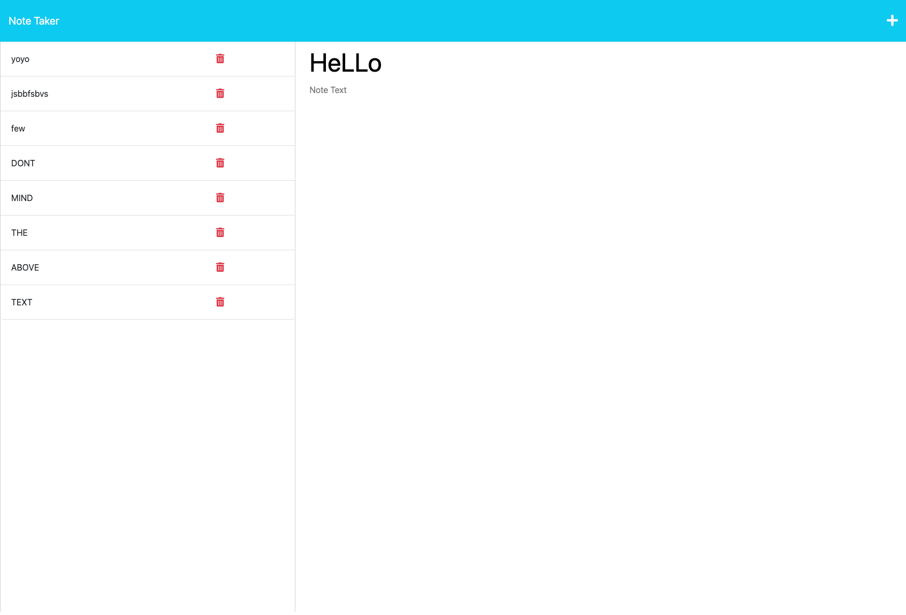

# Note-Taker

## Description:
A note taking app that uses express.js to manage endpoints.  When the user writes a note and clicks the save icon, the note will be stored and saved for future viewing.

## Installation:
Clone the repo then run the command ```npm i```
## Screenshot:

## Link:
[Heroku link](https://my-note-taking-app.herokuapp.com/notes)